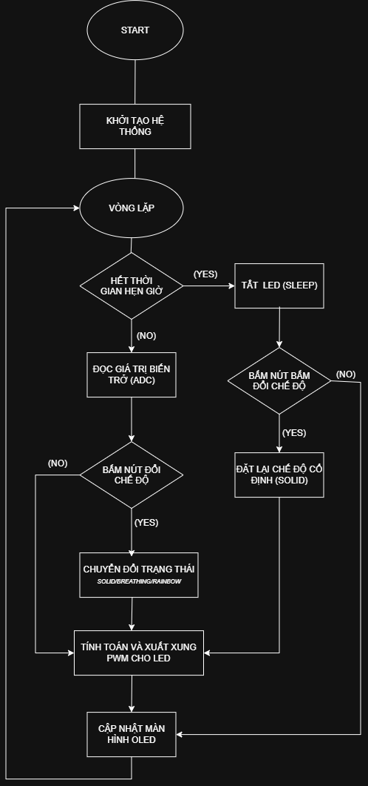

# Multi-Mode RGB Mood Lamp with Auto-Off Timer on STM32F103C8T6

This project implements an embedded ambient lighting system using the STM32F103C8T6 (ARM Cortex-M3) microcontroller. It combines 3-channel 16-bit Timer PWM color blending, real-time potentiometer brightness regulation via ADC, a push-button auto-off countdown timer, an SSD1306 OLED interface, and a browser-based control dashboard. The dashboard reaches the lamp either directly over USB (Web Serial) or **from anywhere on the Internet** through an ESP32-S3 that bridges MQTT to the STM32 UART at 115200 baud.

### ▶ Live control panel

**https://web-tikoocs-projects.vercel.app/?id=moodlamp-a3781afd**

The `?id=` query is required — it tells the page which lamp to address. The
lamp only answers while its ESP32-S3 is powered and on WiFi; the panel shows
**Đèn online** or **Đèn đang offline** in the top-right corner. You do not need
to be on the same network as the lamp.

---

## Table of Contents

1. [System Overview](#1-system-overview)
2. [Hardware Bill of Materials](#2-hardware-bill-of-materials)
3. [System Flowchart & Control Logic](#3-system-flowchart--control-logic)
4. [Hardware Pinout & Peripheral Mapping](#4-hardware-pinout--peripheral-mapping)
5. [Operational Lighting Modes](#5-operational-lighting-modes)
6. [Auto-Off Countdown Timer](#6-auto-off-countdown-timer)
7. [Web Control & UART Protocol](#7-web-control--uart-protocol)
8. [Internet Control via ESP32-S3](#8-internet-control-via-esp32-s3)
9. [Demo Video](#9-demo-video)
10. [Limitations and Future Improvements](#10-limitations-and-future-improvements)
11. [Authors](#11-authors)

---

## 1. System Overview

The firmware leverages hardware peripherals of the STM32F103C8T6 MCU to drive a common-cathode RGB LED and manage interactive controls:

TIM3 generates 1 kHz PWM across channels 1, 2, and 3 (PA6, PA7, PB0) for independent color mixing. Analog input from a 10k potentiometer on PA1 is converted through ADC1 to scale total luminous output from 0% to 100%. User control is handled via two tactile buttons: a mode toggle on PB12, and a timer button on PB13 that adds 5 minutes per press up to a 30-minute cap. Both use internal pull-ups with 300 ms software debouncing. Status information is rendered on a 128x64 SSD1306 OLED module over software I2C.

---

## 2. Hardware Bill of Materials

The complete hardware prototype is constructed using the following components and breakout modules:

| Component / Module | Specification / Model | Quantity | Role in System |
| :--- | :--- | :---: | :--- |
| **Microcontroller Board** | STM32F103C8T6 Blue Pill (ARM Cortex-M3, 72 MHz, 64KB Flash) | 1 | Master embedded processing unit |
| **RGB LED Module** |  Common-Cathode RGB LED Breakout Module | 1 | 3-channel PWM mood light emitter |
| **Timer Push Button** | 6x6mm Tactile Momentary Push Button | 1 | Adds 5 minutes to the auto-off timer per press |
| **WiFi Bridge Board** | ESP32-S3 DevKitC-1 (Xtensa LX7, WiFi 2.4 GHz) | 1 | Relays MQTT commands from the Internet to the STM32 UART |
| **OLED Display Module** | 0.96 inch SSD1306 I2C OLED Module (128x64 pixels, Blue/White) | 1 | Real-time status, mode, and countdown visualization |
| **Potentiometer** | 10k Linear Rotary Potentiometer (B10K) | 1 | Analog 0% to 100% master brightness regulator |
| **Mode Push Button** | 6x6mm Tactile Momentary Push Button | 1 | External hardware mode toggle trigger |
| **USB-to-UART Adapter** | CP2102 USB to Serial TTL Adapter | 1 | Bidirectional PC/Web Serial interface (115200 baud) |
| **Debugger / Programmer** | ST-Link V2 USB Dongle | 1 | SWD firmware flashing and hardware debugging |
| **Prototyping Accessories** | Solderless Breadboard and Jumper Wires | 1 set | Circuit interconnects and power distribution |

---

## 3. System Flowchart & Control Logic

The execution flow, mode transition logic, potentiometer ADC brightness mapping, and countdown timer routine are illustrated in the architecture flowchart below:

<div align="center">
  
</div>

---

## 4. Hardware Pinout & Peripheral Mapping

| Device / Module | Module Pin | STM32 Pin | Peripheral Function | Electrical Role |
| :--- | :--- | :--- | :--- | :--- |
| RGB LED Module | Red Channel (R) | PA6 | TIM3_CH1 | 1 kHz PWM Output |
| | Green Channel (G) | PA7 | TIM3_CH2 | 1 kHz PWM Output |
| | Blue Channel (B) | PB0 | TIM3_CH3 | 1 kHz PWM Output |
| | Common Ground (-) | GND | Ground | Common Cathode Reference |
| 10k Potentiometer | Wiper Pin | PA1 | ADC1_IN1 | Analog Voltage Input (0V to 3.3V) |
| | Outer Rails | 3.3V / GND | Power Rails | Voltage Divider Reference |
| Timer Button | Tactile Switch | PB13 | EXTI13 | Falling-Edge, +5 min per press |
| Mode Button | Tactile Switch | PB12 | EXTI12 | Falling-Edge Mode Toggle |
| SSD1306 OLED Module | SCL | PB6 | GPIO Output PP | Software I2C Clock |
| | SDA | PB7 | GPIO Output PP | Software I2C Data |
| | Power (VCC / GND)| 3.3V / GND | Power Rails | Module Display Power |
| USB-UART Bridge | TXD / RXD | PA10 / PA9 | USART1 (RX/TX) | 115200 8N1 Serial Protocol |
| ESP32-S3 Bridge | GPIO17 (TX) | PA10 | USART1_RX | Crossed TX-to-RX, 3.3V logic |
| | GPIO18 (RX) | PA9 | USART1_TX | Crossed RX-to-TX, 3.3V logic |
| | GND | GND | Ground | Mandatory common ground reference |
| ST-Link V2 | SWDIO / SWCLK | PA13 / PA14 | SWD Debug | Firmware Flash & Debug |

---

## 5. Operational Lighting Modes

The lamp implements five discrete operational states:

1. **Solid White:** Drives Red, Green, and Blue channels at full duty cycle. Overall luminous intensity is dynamically scaled by the PA1 potentiometer.
2. **Breathing White:** Modulates intensity through a 3000 ms periodic cycle applying a non-linear Gamma 2.2 curve (`Duty = MaxBright * Progress^2.2`) to match human eye lightness perception.
3. **Rainbow Spectrum:** Cycles through six chromatic spectrum zones (Red -> Yellow -> Green -> Cyan -> Blue -> Magenta -> Red) over a 6000 ms period using linear PWM crossfading without color jumping.
4. **Custom RGB:** Directly applies color coordinates transmitted over UART from the Web Serial palette.
5. **Sleep / Standby:** Sets all PWM compare registers to zero, turning off the LED completely upon manual selection or timer expiration.

---

## 6. Auto-Off Countdown Timer

Each press of the timer button (PB13) adds 5 minutes to the countdown, saturating at a 30-minute ceiling. The button uses the internal pull-up with 300 ms software debouncing, so no external resistor is required.

A background tick decrements the remaining time once per second. The tick accumulates its reference (`timer_last_tick += 1000`) instead of reassigning it from the current millisecond count, which keeps the countdown from drifting over long durations. When the counter reaches zero, the firmware automatically switches to Sleep Mode (Mode 0) and blanks the LED output. Remaining time is continuously updated on the OLED display and echoed over UART.

---

## 7. Web Control & UART Protocol

The dashboard in [`web/`](web/) is a single dependency-free HTML file. It reaches the lamp two ways and picks one automatically at load time:

- **MQTT** — when opened with `?id=<DEVICE_ID>`, it talks to the ESP32-S3 bridge over the Internet (see section 8).
- **Web Serial** — otherwise it asks for a COM port and drives a USB-UART adapter directly.

Either way it sends the **same bytes**, so the STM32 firmware is unaware of which path was used. The interface offers a native color picker, R/G/B sliders, mode preset buttons, and a line-buffered device log.

| Command Packet | Target Action | Example / Details |
| :--- | :--- | :--- |
| `1\n` or `w\n` | Switch to Solid White | Constant white illumination |
| `2\n` or `b\n` | Switch to Breathing White | Gamma 2.2 breathing cycle |
| `3\n` or `r\n` | Switch to Rainbow Spectrum | 6-phase chromatic crossfade |
| `4\n` or `c\n` | Switch to Custom RGB | Uses current custom RGB registers |
| `0\n` or `s\n` | Switch to Sleep Mode | Turns off PWM channels |
| `n\n` or `Space` | Next Mode | Cycles sequentially through states |
| `C:R,G,B\n` | Set Custom RGB Coordinates | Example: `C:255,120,40\n` |
| `#RRGGBB\n` | Set Custom Hex Color | Example: `#FF7828\n` |

Because the firmware parses **one character at a time**, the multi-character packets (`C:R,G,B` and `#RRGGBB`) are only honoured by builds that add a string accumulator to `HAL_UART_RxCpltCallback()`.

To drive the lamp over USB, open `web/index.html` in Chrome or Edge, click Connect STM32 and choose the COM port. For Internet control, see the next section.

### Bench control over SWD

When a debugger is attached, [`tools/`](tools/) drives the lamp without any UART link by writing straight into MCU RAM through OpenOCD:

```bash
./tools/lamp.sh solid | breath | rainbow | sleep | next
./tools/lamp.sh status      # mode, PWM duty, ADC, timer
./tools/lamp.sh monitor     # continuous view, replaces a UART terminal
./tools/lamp.sh timer 5     # set auto-off, 0 cancels
```

The scripts resolve variable addresses from `build/STM32.elf` at run time with `arm-none-eabi-nm`, so they keep working after a rebuild moves things around.

---

## 8. Internet Control via ESP32-S3

The lamp sits behind a home router with a private address, so nothing on the Internet can reach it directly — port forwarding and a static IP would be needed, and neither is practical. Instead **both sides dial out** to a public MQTT broker and hold the connection open:

```
browser (HTTPS) ─┐
                 ├─→ broker.emqx.io ──→ ESP32-S3 ──UART──→ STM32F103
     ESP32-S3 ───┘                                          (the lamp)
         ↑ outbound only, traverses NAT
```

The two devices never learn each other's address; they share a mailbox. No port forwarding, no static IP, and the operator does **not** need to be on the same WiFi as the lamp.

The ESP32 does **not** control the LED. It relays bytes between MQTT and UART — an infinitely long USB-UART cable — and forwards exactly the characters the existing firmware already understands, which is why **no STM32 source change was required**. Lines the STM32 prints travel back the same way and appear in the dashboard log.

Firmware lives in [`esp32_mood_lamp/`](esp32_mood_lamp/) (PlatformIO + Arduino). Before flashing, copy `include/config.example.h` to `include/config.h` and fill in the WiFi credentials and a hard-to-guess `DEVICE_ID`; that file is git-ignored because it holds a password. Note the ESP32-S3 joins **2.4 GHz networks only**.

```bash
cd esp32_mood_lamp && pio run -t upload && pio device monitor
```

Then open the dashboard with the matching id:

```
https://web-tikoocs-projects.vercel.app/?id=<DEVICE_ID>
```

> The broker is a free public one: traffic is not privately encrypted and anyone who guesses the `DEVICE_ID` can drive the lamp. Acceptable for decorative lighting — not for locks or anything hazardous.

---

## 9. Demo Video

Functional testing footage, hardware validation, potentiometer brightness control, encoder timer countdown, and web serial communication can be reviewed here:

[Demo Video](https://drive.google.com/drive/folders/1vPH_NVBRHYjKIKNvcpQxKeFuqSAPMJKs?usp=sharing)

---

## 10. Limitations and Future Improvements

While the current system operates reliably, several hardware and software limitations offer clear opportunities for future development:

1. **State Persistence:** Current configuration parameters (active mode, custom RGB values, timer states) reside in volatile RAM and reset upon power loss. Emulating EEPROM in Flash memory (internal Flash pages) would enable persistent state recovery across reboot cycles.
2. **Wireless Connectivity — implemented:** an ESP32-S3 now bridges MQTT to the UART, so the lamp is reachable from anywhere (section 8). Remaining work: move off the public broker onto an authenticated one, and expose the lamp to Home Assistant via MQTT discovery.
3. **Command Set:** the firmware parses a single character per interrupt, so custom colour, brightness and timer cannot be driven from the web yet. Adding a string accumulator to `HAL_UART_RxCpltCallback()` plus a `STATE_CUSTOM` would close the gap.
4. **Acoustic / Sound Sync Mode:** Adding an analog electret microphone with an operational amplifier or an I2S digital microphone (e.g., INMP441) would allow hardware FFT analysis on the STM32 to create audio-reactive music visualization.
5. **Power Management:** In Sleep Mode, the microcontroller remains in full run mode with peripherals active. Implementing STM32 Stop Mode or Standby Mode with EXTI wakeup would significantly reduce idle current consumption for battery-powered operation.

---

## 11. Authors

- Dang Quang Minh
- Duong Minh Trong
- Ho Thanh Nhan
